# Analiza Architektury UI - Autentykacja Discord OAuth

<architecture_analysis>

## Komponenty wymienione w dokumentacji

Na podstawie przeprowadzonej analizy dokumentacji projektowej i specyfikacji autentykacji, zidentyfikowano następujące komponenty UI związane z procesem autentykacji:

### Strony Astro

1. **Strona główna (Landing Page)** - `/src/pages/index.astro`

   - Publiczna strona z opisem produktu i funkcjonalności
   - Zawiera przycisk "Zaloguj przez Discord"

2. **Strona logowania** - `/src/pages/login.astro`

   - Dedykowana strona z przyciskiem OAuth Discord
   - Obsługa komunikatów o błędach

3. **Strona wyboru serwera** - `/src/pages/servers/select.astro`

   - Wyświetla listę serwerów Discord użytkownika z odpowiednimi uprawnieniami
   - Umożliwia wybór serwera do zarządzania

4. **Dashboard** - `/src/pages/dashboard/index.astro` i `/src/pages/dashboard/servers/[id]/index.astro`
   - Chronione strony dostępne tylko dla zalogowanych użytkowników
   - Wyświetlają dane serwerów i funkcjonalności zarządzania

### Komponenty React

1. **LoginButton** - `/src/components/auth/LoginButton.tsx`

   - Przycisk inicjujący proces logowania przez Discord OAuth
   - Obsługa stanu ładowania

2. **ServerSelector** - `/src/components/auth/ServerSelector.tsx`

   - Lista serwerów Discord z odpowiednimi uprawnieniami
   - Wizualizacja dostępności serwerów

3. **UserMenu** - `/src/components/auth/UserMenu.tsx`

   - Menu użytkownika z avatarem i nazwą użytkownika
   - Opcje wylogowania i przełączania serwerów

4. **AuthGuard** - `/src/components/auth/AuthGuard.tsx`
   - HOC zapewniający ochronę komponentów wymagających autentykacji
   - Weryfikacja uprawnień użytkownika

### Layouts

1. **Layout** - `/src/layouts/Layout.astro`

   - Podstawowy layout aplikacji
   - Rozszerzony o kontekst autentykacji

2. **DashboardLayout** - `/src/layouts/DashboardLayout.astro`
   - Layout dla chronionych stron dashboardu
   - Zawiera weryfikację autentykacji przed renderowaniem

### Komponenty Dashboard

1. **Sidebar** - `/src/components/dashboard/Sidebar.tsx`

   - Panel boczny z nawigacją
   - Wyświetla informacje o zalogowanym użytkowniku
   - Umożliwia wybór i przełączanie między serwerami

2. **Topbar** - `/src/components/dashboard/Topbar.tsx`

   - Górny pasek nawigacyjny
   - Wyświetla informacje o aktualnie zalogowanym użytkowniku
   - Zawiera menu użytkownika z opcją wylogowania

3. **Drawer** - `/src/components/dashboard/Drawer.tsx`
   - Mobilna wersja Sidebar
   - Zawiera nawigację i podstawowe informacje o użytkowniku

### API Endpoints

1. **Login API** - `/src/pages/api/auth/login.ts`

   - Inicjuje proces OAuth generując URL do Discord
   - Ustawia token state dla CSRF

2. **Callback API** - `/src/pages/api/auth/callback.ts`

   - Obsługuje odpowiedź z Discord OAuth
   - Weryfikuje token, tworzy sesję i przekierowuje użytkownika

3. **Logout API** - `/src/pages/api/auth/logout.ts`

   - Kończy sesję użytkownika
   - Czyści cookies i przekierowuje do strony głównej

4. **User Info API** - `/src/pages/api/auth/me.ts`

   - Zwraca informacje o aktualnie zalogowanym użytkowniku
   - Pobiera dane z Discord API i Supabase

5. **Servers List API** - `/src/pages/api/servers/list.ts`
   - Pobiera listę serwerów użytkownika przy użyciu Discord.js
   - Filtruje serwery pod kątem uprawnień

### Middleware i Serwisy

1. **Auth Middleware** - `/src/middleware/auth.ts`

   - Weryfikuje sesję przy każdym żądaniu
   - Przekazuje kontekst autentykacji do wszystkich stron

2. **Auth Service** - `/src/lib/services/auth.ts`

   - Zarządza sesją i tokenami
   - Obsługuje komunikację z Supabase Auth

3. **Auth Context** - `/src/lib/contexts/AuthContext.tsx`
   - Dostarcza kontekst autentykacji dla komponentów React
   - Metody do zarządzania sesją

## Przepływ danych między komponentami

1. **Proces logowania**:

   - Użytkownik klika LoginButton na LandingPage lub LoginPage
   - LoginButton wywołuje AuthLoginEndpoint
   - AuthLoginEndpoint przekierowuje do Discord OAuth
   - Discord OAuth przekierowuje do AuthCallbackEndpoint
   - AuthCallbackEndpoint tworzy sesję i przekierowuje do ServerSelectPage
   - ServerSelectPage wyświetla ServerSelector z listą dostępnych serwerów
   - Po wyborze serwera następuje przekierowanie do DashboardIndex

2. **Weryfikacja sesji**:

   - AuthMiddleware weryfikuje sesję przy każdym żądaniu
   - AuthMiddleware korzysta z AuthService do weryfikacji tokenów
   - AuthMiddleware dostarcza kontekst do AuthContext
   - AuthGuard wykorzystuje AuthContext do ochrony komponentów
   - DashboardLayout korzysta z AuthContext do wyświetlania informacji o użytkowniku

3. **Wylogowanie**:
   - Użytkownik klika opcję wylogowania w UserMenu
   - UserMenu wywołuje AuthLogoutEndpoint
   - AuthLogoutEndpoint kończy sesję i przekierowuje do LandingPage

## Zależności między komponentami związanymi z autentykacją a resztą aplikacji

1. **Layout jako podstawa**:

   - Layout jest rozszerzany przez DashboardLayout
   - DashboardLayout zawiera komponenty Sidebar, Topbar i Drawer
   - Wszystkie chronione strony korzystają z DashboardLayout

2. **Ochrona zasobów**:

   - AuthGuard chroni strony DashboardIndex, ServerDashboard, KnowledgePage i SettingsPage
   - AuthMiddleware weryfikuje sesję przed każdym żądaniem do chronionych zasobów

3. **Przepływ danych**:

   - AuthContext dostarcza informacje o zalogowanym użytkowniku do UserMenu i ServerSelector
   - UserMenu i ServerSelector wyświetlają dane użytkownika z AuthContext
   - API Endpoints korzystają z AuthService do weryfikacji i zarządzania sesjami

4. **Nawigacja**:
   - DashboardIndex umożliwia nawigację do ServerDashboard po wyborze serwera
   - ServerDashboard umożliwia nawigację do KnowledgePage i SettingsPage
   - Sidebar i Drawer zapewniają nawigację między różnymi stronami dashboardu

```mermaid
flowchart TD
    subgraph "Moduł Autentykacji"
        LoginPage["Strona Logowania\n/src/pages/login.astro"]
        LandingPage["Strona Główna\n/src/pages/index.astro"]
        ServerSelectPage["Strona Wyboru Serwera\n/src/pages/servers/select.astro"]

        LoginButton["LoginButton\n/src/components/auth/LoginButton.tsx"]
        ServerSelector["ServerSelector\n/src/components/auth/ServerSelector.tsx"]
        UserMenu["UserMenu\n/src/components/auth/UserMenu.tsx"]
        AuthGuard["AuthGuard\n/src/components/auth/AuthGuard.tsx"]
    end

    subgraph "Layouts"
        Layout["Layout.astro\n/src/layouts/Layout.astro"]
        DashboardLayout["DashboardLayout.astro\n/src/layouts/DashboardLayout.astro"]

        style Layout fill:#f9f,stroke:#333,stroke-width:2px
        style DashboardLayout fill:#f9f,stroke:#333,stroke-width:2px
    end

    subgraph "API Endpoints"
        AuthLoginEndpoint["Login API\n/src/pages/api/auth/login.ts"]
        AuthCallbackEndpoint["Callback API\n/src/pages/api/auth/callback.ts"]
        AuthLogoutEndpoint["Logout API\n/src/pages/api/auth/logout.ts"]
        AuthMeEndpoint["User Info API\n/src/pages/api/auth/me.ts"]
        ServersListEndpoint["Servers List API\n/src/pages/api/servers/list.ts"]

        style AuthLoginEndpoint fill:#bbf,stroke:#333,stroke-width:2px
        style AuthCallbackEndpoint fill:#bbf,stroke:#333,stroke-width:2px
        style AuthLogoutEndpoint fill:#bbf,stroke:#333,stroke-width:2px
        style AuthMeEndpoint fill:#bbf,stroke:#333,stroke-width:2px
        style ServersListEndpoint fill:#bbf,stroke:#333,stroke-width:2px
    end

    subgraph "Middleware i Serwisy"
        AuthMiddleware["Auth Middleware\n/src/middleware/auth.ts"]
        AuthService["Auth Service\n/src/lib/services/auth.ts"]
        AuthContext["Auth Context\n/src/lib/contexts/AuthContext.tsx"]

        style AuthMiddleware fill:#bfb,stroke:#333,stroke-width:2px
        style AuthService fill:#bfb,stroke:#333,stroke-width:2px
        style AuthContext fill:#bfb,stroke:#333,stroke-width:2px
    end

    subgraph "Komponenty Dashboard"
        Sidebar["Sidebar\n/src/components/dashboard/Sidebar.tsx"]
        Topbar["Topbar\n/src/components/dashboard/Topbar.tsx"]
        Drawer["Drawer\n/src/components/dashboard/Drawer.tsx"]

        style Sidebar fill:#bbf,stroke:#333,stroke-width:2px
        style Topbar fill:#bbf,stroke:#333,stroke-width:2px
        style Drawer fill:#bbf,stroke:#333,stroke-width:2px
    end

    subgraph "Strony Dashboard"
        DashboardIndex["Dashboard Home\n/src/pages/dashboard/index.astro"]
        ServerDashboard["Server Dashboard\n/src/pages/dashboard/servers/[id]/index.astro"]
        KnowledgePage["Knowledge Page\n/src/pages/dashboard/servers/[id]/knowledge/index.astro"]
        SettingsPage["Settings Page\n/src/pages/dashboard/servers/[id]/settings.astro"]

        style DashboardIndex fill:#fbb,stroke:#333,stroke-width:2px
        style ServerDashboard fill:#fbb,stroke:#333,stroke-width:2px
        style KnowledgePage fill:#fbb,stroke:#333,stroke-width:2px
        style SettingsPage fill:#fbb,stroke:#333,stroke-width:2px
    end

    %% Powiązania między komponentami

    %% Przepływ autentykacji
    LandingPage -->|"Zawiera"| LoginButton
    LoginPage -->|"Zawiera"| LoginButton
    LoginButton -->|"Inicjuje"| AuthLoginEndpoint
    AuthLoginEndpoint -->|"Przekierowuje"| AuthCallbackEndpoint
    AuthCallbackEndpoint -->|"Przekierowuje"| ServerSelectPage
    ServerSelectPage -->|"Zawiera"| ServerSelector
    ServerSelector -->|"Wykorzystuje"| ServersListEndpoint
    ServerSelector -->|"Przekierowuje"| DashboardIndex

    %% Struktura aplikacji
    Layout -->|"Jest rozszerzany przez"| DashboardLayout
    DashboardLayout -->|"Zawiera"| Sidebar
    DashboardLayout -->|"Zawiera"| Topbar
    DashboardLayout -->|"Zawiera"| Drawer

    %% Menu użytkownika
    Topbar -->|"Wyświetla"| UserMenu
    UserMenu -->|"Wykorzystuje"| AuthMeEndpoint
    UserMenu -->|"Inicjuje wylogowanie"| AuthLogoutEndpoint

    %% Middleware i kontekst
    AuthMiddleware -->|"Weryfikuje"| AuthService
    AuthService -->|"Zarządza"| AuthContext
    AuthContext -->|"Dostarczany do"| DashboardLayout

    %% Ochrona zasobów
    AuthGuard -->|"Chroni"| DashboardIndex
    AuthGuard -->|"Chroni"| ServerDashboard
    AuthGuard -->|"Chroni"| KnowledgePage
    AuthGuard -->|"Chroni"| SettingsPage

    %% Przepływ nawigacji
    DashboardIndex -->|"Przekierowuje do"| ServerDashboard
    ServerDashboard -->|"Nawiguje do"| KnowledgePage
    ServerDashboard -->|"Nawiguje do"| SettingsPage

    %% Przepływ danych
    AuthContext -->|"Zapewnia kontekst"| UserMenu
    AuthContext -->|"Zapewnia kontekst"| ServerSelector
    AuthContext -->|"Zapewnia kontekst"| AuthGuard

    classDef current fill:#f96,stroke:#333,stroke-width:2px;
```

</architecture_analysis>

<mermaid_diagram>

</mermaid_diagram>
